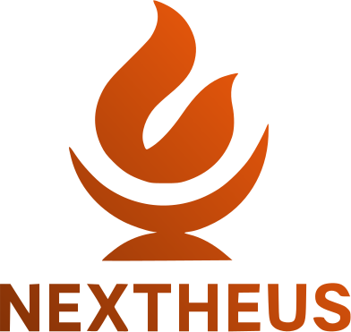

# 🚀 Nextheus

<div align="center">
  
  
  <p align="center">
    <strong>Boilerplate moderno para Next.js com foco em MicroSaaS</strong>
  </p>
  
  <p align="center">
    Acelere seu desenvolvimento com um template completo, configurado e pronto para produção
  </p>

  <p align="center">
    
    
    
    
  </p>

  <p align="center">
    <a href="#-recursos">Recursos</a> •
    <a href="#-início-rápido">Início Rápido</a> •
    <a href="#-documentação">Documentação</a> •
    <a href="#-contribuindo">Contribuindo</a>
  </p>
</div>

---

## 🎯 **O que é o Nextheus?**

O **Nextheus** é um boilerplate completo para criar aplicações **MicroSaaS** usando **Next.js 15** como tecnologia principal. Foi desenvolvido para eliminar o tempo perdido com configurações básicas, permitindo que desenvolvedores foquem nas regras de negócio desde o primeiro dia.

### 💡 **Motivação**

Perder tempo com configurações básicas de projeto ao invés de partir para construir sua POC sempre acaba desmotivando o desenvolvedor. O Nextheus surge para amenizar essa curva e fazer com que você se concentre no que realmente importa: **suas regras de negócio**.

---

## ✨ **Recursos**

### 🏗️ **Tecnologias Incluídas**
- **Next.js 15** - Framework React para produção
- **TypeScript** - Tipagem estática para JavaScript
- **Tailwind CSS** - Framework CSS utilitário
- **Shadcn/ui** - Componentes de UI modernos
- **Supabase** - Backend como serviço (Auth + Database)
- **AbacatePay** - Sistema de pagamentos integrado
- **ESLint + Prettier** - Qualidade e formatação de código

### 🎨 **Interface e UX**
- ✅ Landing page completa e responsiva
- ✅ Sistema de autenticação pronto
- ✅ Dashboard com sidebar navegável
- ✅ Componentes UI pré-construídos
- ✅ Temas claro/escuro
- ✅ Design system consistente

### 🔐 **Autenticação e Segurança**
- ✅ Login/cadastro com Supabase Auth
- ✅ Proteção de rotas
- ✅ Middleware de autenticação
- ✅ Gestão de sessões
- ✅ Recuperação de senha

### 💳 **Pagamentos e Assinaturas**
- [ ] Integração com AbacatePay
- [ ] Sistema de assinaturas
- [ ] Webhooks configurados
- [ ] Dashboard de pagamentos

### 📱 **Experiência do Desenvolvedor**
- ✅ Hot reload configurado
- ✅ Scripts de desenvolvimento otimizados
- ✅ Estrutura de pastas organizada
- ✅ Configurações de ambiente
- ✅ Deploy pronto para Vercel

---

## 🚀 **Início Rápido**

### **Pré-requisitos**
- Node.js 18+ 
- pnpm (recomendado)

### **1. Clone o repositório**
```bash
git clone https://github.com/AntDavi/nextheus.git
cd nextheus
```

### **2. Instale as dependências**
```bash
pnpm install
```

### **3. Configure as variáveis de ambiente**
```bash
cp .env.example .env.local
```

Edite o arquivo `.env.local` com suas configurações:

```env
# Supabase
NEXT_PUBLIC_SUPABASE_URL=your_supabase_url
NEXT_PUBLIC_SUPABASE_ANON_KEY=your_supabase_anon_key
SUPABASE_SERVICE_ROLE_KEY=your_service_role_key
```

### **4. Inicie o servidor de desenvolvimento**
```bash
pnpm dev
```

Acesse [http://localhost:3000](http://localhost:3000) para ver sua aplicação rodando! 🎉

---

## 📚 **Documentação**

### **Estrutura do Projeto**

```
nextheus/
├── src/
│   ├── app/                  # App Router (Next.js 15)
│   │   ├── (auth)/          # Grupo de rotas de autenticação
│   │   ├── (main)/          # Grupo de rotas principais
│   │   ├── globals.css      # Estilos globais
│   │   └── layout.tsx       # Layout raiz
│   ├── components/          # Componentes reutilizáveis
│   │   ├── ui/             # Componentes base (shadcn/ui)
│   │   ├── header.tsx      # Cabeçalho da aplicação
│   │   ├── footer.tsx      # Rodapé
│   │   └── ...
│   ├── hooks/              # Custom hooks
│   ├── lib/                # Utilitários e configurações
│   └── utils/              # Funções auxiliares
├── public/                 # Arquivos estáticos
├── utils/                  # Dados e configurações externas
└── ...
```


### **Customização**

#### **🎨 Personalizando o Design**
```bash
# Cores e temas estão em:
src/app/globals.css

# Componentes customizáveis:
src/components/ui/
```

#### **🔧 Configurando Autenticação**
```typescript
// src/lib/supabase/client.ts
import { createClient } from '@supabase/supabase-js'

export const supabase = createClient(
  process.env.NEXT_PUBLIC_SUPABASE_URL!,
  process.env.NEXT_PUBLIC_SUPABASE_ANON_KEY!
)
```

#### **Outros Provedores**
O Nextheus é compatível com qualquer provedor que suporte Next.js:
- Netlify
- Railway
- Render
- Digital Ocean App Platform

---

## 🛠️ **Desenvolvimento Avançado**

### **Adicionando Novas Páginas**
```bash
# Crie um novo arquivo em src/app/
touch src/app/nova-pagina/page.tsx
```

### **Criando Componentes**
```bash
# Use o padrão do projeto:
src/components/
├── meu-componente.tsx           # Componente principal
└── ui/meu-componente-ui.tsx     # Variante UI (se necessário)
```

### **Configurando Middleware**
```typescript
// middleware.ts
import { createMiddlewareClient } from '@supabase/auth-helpers-nextjs'
import { NextResponse } from 'next/server'

export async function middleware(req) {
  // Sua lógica de middleware aqui
}
```

---

## 📄 **Licença**

Este projeto está licenciado sob a **MIT License** - veja o arquivo [LICENSE](LICENSE) para detalhes.

---

## 🙏 **Agradecimentos**

- [Next.js](https://nextjs.org/) - Framework React
- [Supabase](https://supabase.com/) - Backend como serviço
- [Tailwind CSS](https://tailwindcss.com/) - Framework CSS
- [Shadcn/ui](https://ui.shadcn.com/) - Componentes de UI
- [AbacatePay](https://abacatepay.com/) - Sistema de pagamentos

---

<div align="center">
  <p>Feito com ❤️ para a comunidade de desenvolvedores</p>
  <p>⭐ Deixe uma estrela se este projeto te ajudou!</p>
</div>
